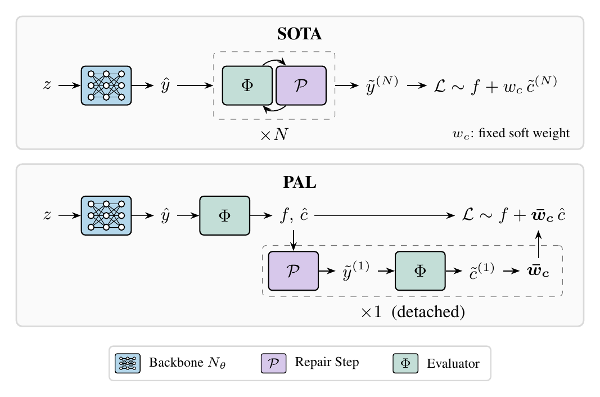

<div align="center">

# Only Project Once: Projection-Adaptive Loss for Exact Constraint Satisfaction

Tim Aebersold, Soheyl Massoudi, Mark Fuge

ETH Zürich

[](LICENSE)
[](.python-version)

</div>

<p align="center">
  
</p>

Methods that repair neural predictions to satisfy hard constraints usually
unroll many repair steps per training iteration and softly penalize whatever
violation is left. **PAL** (Projection-Adaptive Loss) shows that a single
detached projection step suffices in training. The constraint residual after
that one step drives adaptive penalty weights $\bar w_c$ on the raw prediction,
so the network itself learns to be feasible and the repair only cleans up.

This repository contains the method (`pal/method`, `pal/projection`), the
baselines (`pal/baselines`), the synthetic and engineering benchmarks
(`pal/benchmarks`), the experiment runner (`pal/runner`) and the scripts and
results behind the paper tables.

## Install

```bash
python -m venv .venv && source .venv/bin/activate
pip install -e .
python scripts/download_artifacts.py --benchmark e2   # WinDiNet weights, only for e2
```

With [uv](https://docs.astral.sh/uv/), `uv sync --extra bo` installs the
locked versions from `uv.lock` into `.venv/` instead.

On first use e2 also downloads the `Lightricks/LTX-Video` base weights from
Hugging Face, which the WinDiNet surrogate fine-tunes. The Bayesian
optimisation tuning in `scripts/bo/` needs the optional `bo` extra
(`pip install -e '.[bo]'`, exact pins in `scripts/bo/requirements-bo.txt`).
IPOPT is optional and installed separately (`conda install -c conda-forge
cyipopt`, see `pal/baselines/ipopt/README.md`). `PAL_DATA_DIR` (default
`~/.pal_data`) sets where downloaded artifacts are cached.

## Benchmarks

| Paper | Code id | |
|---|---|---|
| S1-S6 | `s1_sphere_track`, `s2_active_set_switch`, `s3_illcond_tube`, `s4_qv_coupling`, `s5_overdetermined`, `s6_redundant_ineq` | synthetic, CPU |
| curvature sweep | `curvature_warp_k0` ... `curvature_warp_k13` | synthetic, CPU |
| E1 | `e1/bwb` | aircraft design, GPU |
| E2 | `e2/urban_wind` | urban layout with a diffusion wind surrogate, GPU |
| E3 | `e3/acopf_ieee57` | AC optimal power flow |
| E4 | `e4/chip_layout` | macro placement, CPU |

`rosenbrock_eq`, `two_basins` and `equality_dominated` (small test fixtures),
`curvature_hinge_k*` and `curvature_sine_k*` (control families of the
curvature sweep) and `e3/acopf_ieee30`, `e3/acopf_ieee118` are additional
benchmarks that are not used in the paper.

## Running

```bash
# one synthetic benchmark, PAL and two baselines, three seeds
pal run --method pal_loggap,alm,fsnet --benchmarks s1_sphere_track --seeds 0,1,2 --device cpu

# one engineering benchmark
pal run --method pal_loggap --benchmarks e1/bwb --seeds 0 --device cuda
```

Methods: `pal_loggap` (PAL), `pal_sqp` and `pal_ip` (PAL with SQP or
interior-point repair steps), `alm`, `alm_bolton`, `dc3`, `enforce_orig`,
`enforce_v4`, `fsnet`, `snarenet`, `slsqp`, `ipopt`. Hand-set defaults for
ALM, ALM+Bolt-On, DC3 and FSNet are read from `pal/baselines/hparams/`, and the
other methods define theirs in their config classes. The paper's tuned
configurations are the BO winners listed below. Each run writes `config.json`, `final.json`
(objective, maximum violation and feasibility before and after projection),
`metrics.jsonl` and `model.pt` to `runs/<timestamp>_<method>_<bench>_seed<N>_<id>/`.
`pal eval --run-id <prefix>` re-runs inference on a saved model.
See `quickstart.md` for a minimal check of an installation.

## Reproducing the paper

`results/README.md` lists every results directory, the paper table it feeds
and the command that produces it. The main entry points are:

- `scripts/bo/` Bayesian optimisation of each method's hyperparameters on
  S1-S6. The selected configurations are in `results/2026-07-26_bo_tuned_table/winners/`
  (ENFORCE v4: `results/2026-09-11_enforce_v4_no_warmup/winners/`).
- `scripts/run_ablation.py --ablation pal/configs/ablations/s1_s6.yaml` for
  the PAL ablation.
- `scripts/bp_campaign/driver.py` for the curvature sweep on `curvature_warp`.
- `scripts/fp64_repair_sweep.py` for the repair-precision table.
- `slurm/engineering/*.sbatch` for the engineering runs, and
  `scripts/aggregate.py`, `scripts/aggregate_engineering.py` and
  `scripts/render_engineering.py` to turn run directories into tables.

The Slurm files assume a GPU cluster with a container runtime (`docker/`,
`edf/`) and need the account and paths adapted.

## Tests

```bash
python -m pytest tests -q
```

## Citation

```bibtex
@misc{aebersold2026onlyprojectonce,
  title  = {Only Project Once: Projection-Adaptive Loss for Exact Constraint Satisfaction},
  author = {Aebersold, Tim and Massoudi, Soheyl and Fuge, Mark},
  year   = {2026}
}
```
